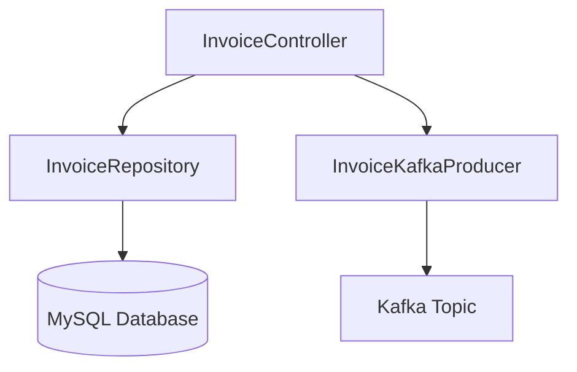
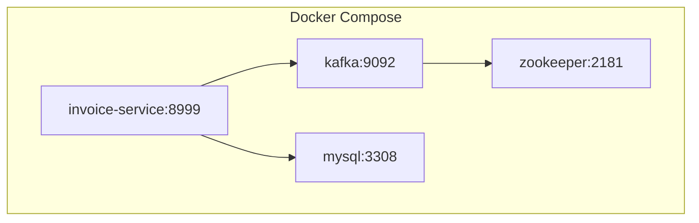

# Invoice Service

This interview focused project, is a Spring Boot microservice that handles invoice creation, updates, and deletions. It persists data to MySQL and publishes relevant events to Kafka.


---

## Features

- REST API for invoice management
- Kafka event publishing for invoice lifecycle events
- MySQL persistence via Spring Data JPA
- Docker Compose setup for local development

---

## Architecture Overview



---

## Deployment Topology



---

## Running the Service

```bash
docker compose -f src/main/docker/docker-compose.yml up -d
./mvnw spring-boot:run
```

Once running, the service is accessible at: [http://localhost:8999/api/invoices](http://localhost:8999/api/invoices)

---

## API Endpoints

- `GET /api/invoices` — List all invoices
- `POST /api/invoices` — Create a new invoice
- `PUT /api/invoices/{id}` — Update an invoice
- `DELETE /api/invoices/{id}` — Delete an invoice

---

## Technologies

- Java 17
- Spring Boot 3.5.4
- Spring Data JPA
- Spring Kafka
- MySQL 8
- Kafka (Confluent)
- Docker Compose
- Lombok
- JUnit & Mockito (for testing)

---

## Author
_Sithlord_
